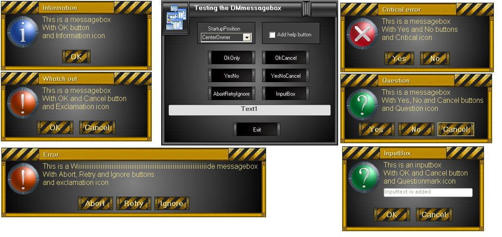



## DMmessagbox

### Description

Cool graphical messagebox/inputbox that automaticly resizes to the right dimensions based on the message and buttons needed.

Code for custom formskinning, buttonskinning and textbox included.
 
### More Info
 

             |
---                |---
**Submitted On**   |2010-02-08 13:19:08
**By**             |[Frank Donckers](https://github.com/Planet-Source-Code/PSCIndex/blob/master/ByAuthor/frank-donckers.md)
**Level**          |Advanced
**User Rating**    |4.9 (44 globes from 9 users)
**Compatibility**  |VB 6\.0
**Category**       |[Custom Controls/ Forms/  Menus](https://github.com/Planet-Source-Code/PSCIndex/blob/master/ByCategory/custom-controls-forms-menus__1-4.md)
**World**          |[Visual Basic](https://github.com/Planet-Source-Code/PSCIndex/blob/master/ByWorld/visual-basic.md)
**Archive File**   |[DMmessagbo217452292010\.zip](https://github.com/Planet-Source-Code/frank-donckers-dmmessagbox__1-72907/archive/master.zip)

